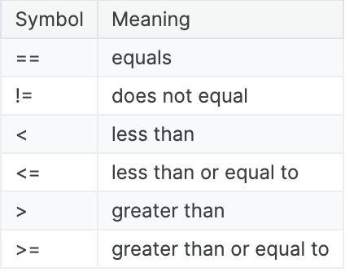

# Conditions 
In programming, **conditions** are statements that are either:
```shell
1. True
2. False
```
There are many different ways to write conditions in Python, but some of the most commin ways of writing conditions just compare two different values.
- For instance, one can check if 2 is greater than 3:

```bash 
print (2 > 3) # The output is False, given 2 is less than 3
```

Conditions can also be used to compare the values of variables.

```bash
var_one = 1
var_two = 2

print(var_one < 1) # The output is False, given var_one is equal to 1
print(var_two >= var_one) # The output is True because var_two contains the number 2, which is greater than the value of var_one, which is 1
```
For a list of common symbols one can use to construct conditions, check the chart below:



**Important Note:** 
When you check whether two values are equal, make sure to use the `==` sign and not the `=` sign
* var_one == 1 checks if the value of var_one is 1
* var_one = 1 sets the value of var_one to 1


## Conditional Statements

Conditional statements use conditions to modify how your function runs. They check the value of a condition and if the condition evaluates to `True`, then a certain block of code is executed.
(_Otherwise, if the condition is `False`, then the code is not run._)

### "if" statements
The simplest type of conditional statement is an `if` statement.
- Example

To evaluate body temperature (in Celcius)

* Initially, message is set to `Normal temperature`

* Then, if `temp > 38` is True (e.g., the body temperature is greater than 38 degrees celcius), then the message is updated to `Fever!`.

* Otherwise, if `temp > 38` is False, then the message is not updated

* Finally, message is returned by the function

```bash
def evaluate_temp(temp):
    # Set the initial message
    message = "Normal temperature."

    # Update value of message only if the temperature is > than 38
    if temp > 38:
        message = "Fever!"
    return message

print(evaluate_temp(39))
```


